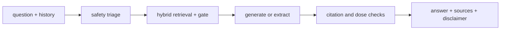
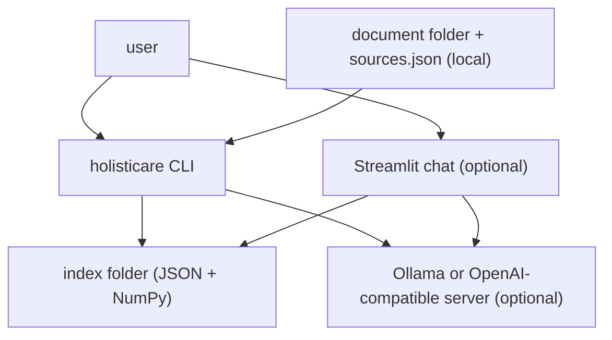
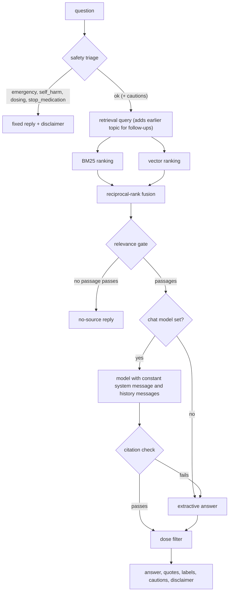

<div align="center">

# holisticare-rag — Local Health Information Assistant With Cited Sources

**holisticare-rag is a local question-answer assistant for health information in your own documents. It takes a question through these steps to give a short answer with checked citations:**

`safety triage` → `history-aware query` → `hybrid retrieval + relevance gate` → `generate (temperature ≤ 0.3)` → `check citations and doses`.


**[Summary](#1-summary)** ·
**[Workflow](#4-the-end-to-end-workflow)** ·
**[Run it](#10-how-to-run-holisticare-rag)** ·
**[Configuration](#104-environment-variables)** ·
**[Known problems](#13-known-problems)** ·
**[Glossary](#15-glossary)**

</div>

> [!NOTE]
> This README uses ASD-STE100 Simplified Technical English. The writing rules and the project
> vocabulary are in [`docs/ste-style-guide.md`](docs/ste-style-guide.md). Each term in the
> [Glossary](#15-glossary) has only one meaning.

> [!WARNING]
> Do not use holisticare-rag as a medical decision tool. It gives general information from the documents that you
> index, and it can be wrong. A qualified health professional must review every decision about a diagnosis, a
> treatment or a medicine.

---

holisticare-rag answers health questions from a local library of documents that you choose and label. The main idea is safety before generation. Fixed rules catch emergencies, self-harm, dosing and stop-medication questions before any retrieval. A relevance gate refuses questions that the documents do not cover. Each answer sentence must cite a passage, and evidence-based and traditional-medicine sources stay apart.

This README is the **one location that explains all of holisticare-rag**. It gives these topics:

- the general design
- each component and its procedure, step by step
- the decision rules
- the data map
- the runbook
- the validation results and the known problems

| If you are… | Read |
|---|---|
| A manager or reviewer | [1](#1-summary), [3](#3-design-rules), [4](#4-the-end-to-end-workflow), [12](#12-validation-results), [13](#13-known-problems) |
| A developer who joins the project | All sections, in sequence. Keep [10](#10-how-to-run-holisticare-rag) and [13](#13-known-problems) open while you work |
| An operator who runs holisticare-rag | [10](#10-how-to-run-holisticare-rag), [8](#8-the-safety-rules), then [13](#13-known-problems) |

---

## Table of contents

1. 🧭 [Summary](#1-summary)
2. 🏗️ [How holisticare-rag is built](#2-how-holisticare-rag-is-built)
   - 2.1 [Components](#21-components)
   - 2.2 [System context](#22-system-context)
   - 2.3 [Repository layout](#23-repository-layout)
3. 🛡️ [Design rules](#3-design-rules)
4. 🔄 [The end-to-end workflow](#4-the-end-to-end-workflow)
   - 4.1 [Full flow](#41-full-flow)
   - 4.2 [The life cycle of one question](#42-the-life-cycle-of-one-question)
5. 🔵 [The knowledge base and the index](#5-the-knowledge-base-and-the-index)
6. 🟢 [Retrieval and the relevance gate](#6-retrieval-and-the-relevance-gate)
7. 🟣 [Generation and the answer checks](#7-generation-and-the-answer-checks)
8. ⚖️ [The safety rules](#8-the-safety-rules)
9. 🗂️ [Data and file map](#9-data-and-file-map)
10. ▶️ [How to run holisticare-rag](#10-how-to-run-holisticare-rag)
    - 10.1 [Prerequisites](#101-prerequisites) · 10.2 [Installation](#102-installation) · 10.3 [Run holisticare-rag](#103-run-holisticare-rag) · 10.4 [Environment variables](#104-environment-variables)
11. 🧩 [How to extend holisticare-rag](#11-how-to-extend-holisticare-rag)
12. ✅ [Validation results](#12-validation-results)
13. ⚠️ [Known problems](#13-known-problems)
14. 📌 [Key points](#14-key-points)
15. 📖 [Glossary](#15-glossary)
16. 📄 [License](#16-license)

---

## 1. Summary

**The problem.** People ask health questions, and some of the questions are dangerous to answer from a chat model. The difficult questions are:

- Which questions must never get a generated answer (emergencies, self-harm, doses, stopping a treatment)?
- What does the assistant do when the documents do not cover a question?
- How does a follow-up such as "what about for children?" find the earlier topic?
- How can a user check which passage supports each sentence?
- How does the user see the difference between clinical evidence and traditional use?

holisticare-rag gives each of these questions its own component. All of them run locally, and the default setup needs no model server.

| Item | Value |
|---|---|
| Input | A question, the chat history, and a folder of `.md`, `.txt` or `.pdf` documents with a `sources.json` registry |
| Output | An answer with a citation per sentence, a quote per citation, evidence labels, cautions, notes and a disclaimer |
| Components | **8**: ingestion, index, retrieval, query rewrite, safety triage, prompts, chat models, answer checks |
| Providers | Optional: Ollama or an OpenAI-compatible server for generation, sentence-transformers or Ollama for vectors |
| Offline mode | Everything. Hashing vectors, BM25 and an extractive answer need no model and no network |
| Safety | Triage before retrieval, a relevance gate, a citation check, a dose filter, a disclaimer on every answer |
| Tests | **45** unit tests pass locally. In CI, 44 pass and 1 skips (the Streamlit test) |



---

## 2. How holisticare-rag is built

### 2.1 Components

| Component | Module | Purpose |
|---|---|---|
| Settings | `src/holisticare_rag/config.py` | Environment variables and `.env`, with limits (temperature ≤ 0.3) |
| Text helpers | `src/holisticare_rag/text.py` | Tokens, content tokens, query synonyms, sentences |
| Ingestion | `src/holisticare_rag/ingest.py` | Source registry, document loading, section-aware chunks |
| Embedders | `src/holisticare_rag/embed.py` | Hashing (default), sentence-transformers (extra `st`), Ollama |
| Index | `src/holisticare_rag/index.py` | BM25, vectors, JSON files, content fingerprint |
| Retrieval | `src/holisticare_rag/retrieve.py` | BM25 + cosine, reciprocal-rank fusion, relevance gate |
| Query rewrite | `src/holisticare_rag/rewrite.py` | History-aware retrieval query for follow-ups |
| Safety | `src/holisticare_rag/safety.py` | Triage rules, fixed replies, cautions, dose filter, disclaimer |
| Prompts | `src/holisticare_rag/prompts.py` | Constant system message, history as messages, numbered passages |
| Chat models | `src/holisticare_rag/llm.py` | `OllamaChat`, `OpenAICompatChat`, `ScriptedChat` (tests) |
| Answers | `src/holisticare_rag/answer.py` | Extractive answer, citation check, supporting quotes |
| Assistant | `src/holisticare_rag/service.py` | The full procedure for one question |
| Evaluation | `src/holisticare_rag/evaluate.py` | Question-set metrics |
| Synthetic data | `src/holisticare_rag/synthetic.py` | Fictional knowledge base and question set |
| Streamlit app | `src/holisticare_rag/app.py` | Chat page with cached resources (extra `ui`) |
| CLI | `src/holisticare_rag/cli.py` | The `holisticare` command |

### 2.2 System context



### 2.3 Repository layout

```
holisticare-rag/
├── .github/workflows/ci.yml   # pytest on Python 3.11
├── data/README.md             # how to add documents, registry fields, open sources (no data files)
├── docs/ste-style-guide.md    # writing rules and project vocabulary
├── src/holisticare_rag/       # the package (one module per component, see 2.1)
├── tests/                     # 45 offline tests on the fictional knowledge base
├── .env.example               # variable names only
├── pyproject.toml             # dependencies, extras, the holisticare command
└── LICENSE                    # MIT
```

---

## 3. Design rules

### 3.1 Safety before retrieval
`safety.triage` runs first on every question. An emergency, self-harm, dosing or stop-medication question gets a fixed reply. No retrieval and no model call happen for these questions.

### 3.2 No answer without a source
The relevance gate needs a passage that holds at least half of the content tokens of the question (`HOLISTICARE_MIN_COVERAGE`). If no passage passes, the answer says that the documents do not cover the question. The model is not called.

### 3.3 User text never becomes an instruction
The system message is a constant. The history goes to the model as separate user and assistant messages. No template engine reads user text, so braces and "ignore the instructions" stay plain data.

### 3.4 One citation for each sentence
A model answer must cite a passage in at least 80 % of its sentences, and each citation must point to a passage that exists. Otherwise the assistant uses the extractive answer. Each citation shows the passage sentence that supports it best.

### 3.5 Evidence labels stay visible
Each document has an evidence label in `sources.json`: `evidence_based`, `traditional` or `unknown`. The extractive answer puts the labels in separate parts. A traditional part always ends with a statement that clinical evidence does not establish the use.

### 3.6 Low temperature and a token cap
The settings refuse a temperature above 0.3. Ollama gets `temperature` and `num_predict`. An OpenAI-compatible server gets `temperature` and `max_tokens`.

### 3.7 A versioned index with no pickle
The index is JSON Lines, JSON and a NumPy array loaded with `allow_pickle=False`. A SHA-256 fingerprint of the documents, the registry, the chunk settings and the embedder decides if the index is reused or built again.

---

## 4. The end-to-end workflow

### 4.1 Full flow



### 4.2 The life cycle of one question

1. Check the question with the triage rules.
2. If the category stops the question, return the fixed reply and the disclaimer.
3. If the question is a follow-up, add the content tokens of the earlier user questions to the retrieval query.
4. Rank the chunks with BM25 and with cosine similarity, then fuse the two lists.
5. Keep the top `HOLISTICARE_TOP_K` passages that share at least one token with the query.
6. If no passage reaches the minimum coverage, return the no-source reply.
7. Generate the answer with the chat model, or extract it from the passages.
8. Check the citations. If the check fails, use the extractive answer.
9. Remove each sentence that states a dose or a schedule.
10. Add the quotes, the cautions, the notes and the disclaimer.

---

## 5. The knowledge base and the index

**Purpose.** Turn a folder of labelled documents into searchable chunks, and build the index again only when something changes.

| Input | Output |
|---|---|
| Document folder, `sources.json`, chunk settings, embedder | `chunks.jsonl`, `vectors.npy`, `manifest.json` in the index folder |

**Procedure**

1. List the `.md`, `.txt` and `.pdf` files in the document folder and its sub-folders.
2. Find the registry entry of each file. A file with no entry gets the label `unknown` and a warning.
3. Read the text (one page at a time for a PDF).
4. Split the text into sections at Markdown headings.
5. Split each section at sentence and paragraph borders into chunks of at most `HOLISTICARE_CHUNK_CHARS` characters, with an overlap.
6. Give each chunk its source, title, section, page, evidence label and tradition.
7. Calculate the vectors of all chunks with the embedder.
8. Save the chunks, the vectors and the manifest with the fingerprint.

**Rules**

- `ensure_index` reuses the saved index only if the fingerprint and the format version match. The status is `reused`, `built` or `rebuilt`.
- A PDF needs the extra `pdf` (`pypdf`). Scanned PDFs without a text layer give no text.

---

## 6. Retrieval and the relevance gate

**Purpose.** Find the passages that answer the question, and refuse when there are none.

| Input | Output |
|---|---|
| Retrieval query, index, embedder | Numbered passages with BM25 score, cosine, coverage and fused score, and the gate result |

**Procedure**

1. Make the content tokens of the query and add the query synonyms (for example `treated` adds `care`).
2. Rank the chunks by BM25 (k1 = 1.5, b = 0.75) and by cosine, and keep the top 30 of each list.
3. Fuse the two lists with reciprocal-rank fusion (k = 60).
4. Remove duplicate chunks. Keep the top `HOLISTICARE_TOP_K` passages.
5. Calculate the coverage of each passage: the share of the query content tokens that it contains. Use the full query and each question sentence with two or more content tokens, and keep the highest value.
6. Remove passages with a coverage of 0.
7. Pass the gate if the best coverage is at least `HOLISTICARE_MIN_COVERAGE` (default 0.5).

**Rules**

- A follow-up has a leading phrase such as "what about" or "and", or three or fewer content tokens with a pronoun. Its retrieval query adds up to 8 tokens from earlier user questions.
- The model answers the original question. Only the retrieval query changes.

---

## 7. Generation and the answer checks

**Purpose.** Write a short answer from the passages only, and check it before the user sees it.

| Input | Output |
|---|---|
| Question, passages, history | `Answer`: text, category, citations with quotes, cautions, notes, retrieved sources, model name, disclaimer |

**Procedure**

1. Build the messages: the constant system message, the last `HOLISTICARE_HISTORY_TURNS` turns, then the numbered passages and the question.
2. Send the messages to the chat model, if one is set.
3. Check the reply with `check_citations`.
4. If there is no chat model, or the reply fails, or the model raises an error, make the extractive answer.
5. Remove dose sentences and add a note if a sentence was removed.
6. For each cited passage, select the passage sentence with the largest token overlap with the citing sentences.

| Extractive answer rule | Value |
|---|---|
| Sentences per passage | 1 (the sentence with the largest overlap with the question) |
| Maximum sentences | 4 |
| Parts | evidence-based, unlabelled, traditional (with the evidence statement) |
| Citation form | `sentence [n].` |

| Citation check | Result |
|---|---|
| No sentence with three or more content tokens | Refused: empty answer |
| A citation number outside 1..number of passages | Refused |
| Fewer than 80 % of the sentences have a citation | Refused |

---

## 8. The safety rules

| Category | Example trigger | Result | Retrieval or model call? |
|---|---|---|---|
| `self_harm` | "want to die", "kill myself", "self-harm" | Fixed crisis reply with crisis line examples | No |
| `emergency` | "chest pain", "cannot breathe", "slurred speech", "overdose", "seizure" | Fixed reply: call the local emergency number | No |
| `stop_medication` | "stop taking my insulin", "instead of chemotherapy" | Fixed reply: do not stop or replace a treatment without the doctor | No |
| `dosing` | "how many mg", "dose", "dosage", "500 mg" | Fixed reply: ask a doctor or a pharmacist | No |
| `ok` + `pregnancy` caution | "pregnant", "breastfeeding" | Answer plus a fixed caution | Yes |
| `ok` + `child` caution | "child", "baby", "toddler", "my son" | Answer plus a fixed caution | Yes |
| `no_source` | No passage reaches the minimum coverage | Fixed no-source reply | Retrieval only |

**Rules**

- The rules run in this order: self-harm, emergency, stop-medication, dosing, cautions.
- The dose filter removes each answer sentence with an amount (`mg`, `ml`, `g`, `tablets`, `drops`, `teaspoons`, …) or a schedule ("twice a day").
- Every answer, also a fixed reply, has the disclaimer.
- The triage is a keyword rule set. It is not a clinical triage tool.

---

## 9. Data and file map

| Path | Committed? | Contents |
|---|---|---|
| `data/README.md` | Yes | How to add documents, registry fields, open sources, question-set format |
| `data/documents/` | No (git ignores it) | Your documents and `sources.json` (default of `HOLISTICARE_DOCS_DIR`) |
| `data/synthetic/documents/` | No (git ignores it) | Fictional knowledge base from `holisticare synth` |
| `data/synthetic/eval.jsonl` | No (git ignores it) | Synthetic question set (18 questions) |
| `data/synthetic/eval_results.csv` | No (git ignores it) | Per-question results of `holisticare demo` |
| `.index/chunks.jsonl` | No (git ignores it) | Chunks with source, section, page, evidence label |
| `.index/vectors.npy` | No (git ignores it) | Chunk vectors (float32) |
| `.index/manifest.json` | No (git ignores it) | Format version, fingerprint, embedder, counts, chunk settings |
| `.env` | No (git ignores it) | Local settings and `HOLISTICARE_LLM_API_KEY` |

---

## 10. How to run holisticare-rag

### 10.1 Prerequisites

| Need | For |
|---|---|
| Python 3.11+ | All components |
| numpy, pandas, scikit-learn | Core (installed with the package) |
| Ollama with a model (for example `ollama pull llama3.1`) | `HOLISTICARE_LLM=ollama` |
| An OpenAI-compatible server and `HOLISTICARE_LLM_API_KEY` | `HOLISTICARE_LLM=openai` |
| `pypdf` (extra `pdf`) | PDF documents |
| `sentence-transformers` (extra `st`) | `HOLISTICARE_EMBEDDER=sentence-transformers` |
| `streamlit` (extra `ui`) | The chat page |

### 10.2 Installation

```bash
git clone https://github.com/KrishnaAnnavaram/holisticare-rag.git
cd holisticare-rag
python -m venv .venv
. .venv/bin/activate            # Windows: .venv\Scripts\activate
pip install -e ".[dev]"         # add ,pdf ,st ,ui as necessary
```

### 10.3 Run holisticare-rag

```bash
# Offline demo: fictional knowledge base, three questions, the question set (a few seconds)
holisticare demo

# Fictional knowledge base, then each step
holisticare synth --out-dir data/synthetic
export HOLISTICARE_DOCS_DIR=data/synthetic/documents     # Windows PowerShell: $env:HOLISTICARE_DOCS_DIR="data/synthetic/documents"
holisticare index
holisticare ask "How is Tarsil cough treated?"
holisticare ask "How many mg of Kelvar root should I take?" --json
holisticare eval --questions data/synthetic/eval.jsonl --out reports/eval.csv
holisticare chat

# Your documents in data/documents with sources.json, generated with a local Ollama model
HOLISTICARE_LLM=ollama HOLISTICARE_LLM_MODEL=llama3.1 holisticare ask "What is asthma?"
holisticare ui
pytest -q
```

| Command | Result |
|---|---|
| `holisticare synth` | Writes the fictional knowledge base and the question set |
| `holisticare index [--force]` | Builds, rebuilds or reuses the index and prints the status |
| `holisticare ask "<question>"` | Prints the answer, the cautions, the sources with quotes, the notes and the disclaimer |
| `holisticare chat` | Interactive chat with history (an empty line ends it) |
| `holisticare eval` | Prints per-question results and the summary metrics |
| `holisticare ui` | Starts the Streamlit chat page |
| `holisticare demo` | Runs `synth`, `index`, three questions and `eval` |

### 10.4 Environment variables

| Variable | Used by | Meaning |
|---|---|---|
| `HOLISTICARE_DOCS_DIR` | index | Document folder, default `data/documents` |
| `HOLISTICARE_INDEX_DIR` | index | Index folder, default `.index` |
| `HOLISTICARE_CHUNK_CHARS` | index | Maximum chunk length in characters, default 900 (minimum 200) |
| `HOLISTICARE_CHUNK_OVERLAP` | index | Overlap between chunks, default 120 |
| `HOLISTICARE_EMBEDDER` | index, retrieval | `hashing` (default), `sentence-transformers` or `ollama` |
| `HOLISTICARE_EMBED_MODEL` | index, retrieval | Model name for the two model embedders, default `sentence-transformers/all-MiniLM-L6-v2` |
| `HOLISTICARE_TOP_K` | retrieval | Passages per question, default 4 |
| `HOLISTICARE_MIN_COVERAGE` | retrieval | Relevance gate, default 0.5 |
| `HOLISTICARE_HISTORY_TURNS` | prompts | History turns sent to the model, default 6 |
| `HOLISTICARE_LLM` | generation | `extractive` (default), `ollama` or `openai` |
| `HOLISTICARE_LLM_MODEL` | generation | Model name, default `llama3.1` |
| `HOLISTICARE_LLM_BASE_URL` | generation, Ollama vectors | Server URL, default `http://localhost:11434` (Ollama) or `https://api.openai.com/v1` |
| `HOLISTICARE_LLM_API_KEY` | generation | Key for `openai` (credential) |
| `HOLISTICARE_TEMPERATURE` | generation | Temperature, default 0.1, maximum 0.3 |
| `HOLISTICARE_MAX_TOKENS` | generation | Token cap (`num_predict` for Ollama), default 512 |
| `HOLISTICARE_TIMEOUT_S` | generation, vectors | HTTP timeout in seconds, default 60 |

The settings come from the environment and from a local `.env` file. An environment variable wins over the `.env` file. Credentials are only in a local `.env` file. Git ignores this file. Do not print or commit credentials.

---

## 11. How to extend holisticare-rag

| You want to… | Do this | Code change? |
|---|---|---|
| Add documents | Put the files in the document folder, add entries to `sources.json`, run `holisticare index` | No |
| Use a local model | Install Ollama, pull a model, set `HOLISTICARE_LLM=ollama` | No |
| Use better vectors | Install the extra `st` and set `HOLISTICARE_EMBEDDER=sentence-transformers` | No |
| Add a triage rule | Add a pattern to the lists in `safety.py` and a test in `tests/test_safety.py` | Small |
| Add a query synonym | Add it to `QUERY_SYNONYMS` in `text.py` | Small |
| Add a reranker | Sort the passages in `retrieve.py` with a cross-encoder before the cut to `top_k` | Yes |
| Add a model-based triage | Add a classifier after the rules in `safety.triage`. Keep the rules first | Yes |
| Add a clinician-reviewed question set | Write a JSON Lines file (see `data/README.md`) and run `holisticare eval` | No |

---

## 12. Validation results

| Validation | Result | Command |
|---|---|---|
| Unit tests, local (with Streamlit) | **45 passed** | `pytest -q` |
| Unit tests in CI (no Streamlit) | **44 passed, 1 skipped** | `pytest -q` |
| Question set on the fictional knowledge base | See the table below | `holisticare demo` |

The demo uses the fictional knowledge base (7 documents, 28 chunks, hashing vectors) and the extractive answer. The question set has 18 questions: 11 answerable, 2 off-topic and 5 triage cases. The answerable questions include 2 follow-ups, 2 with injection text or braces and 1 with a pregnancy caution. **These numbers come from synthetic, fictional text.** They show that the pipeline and the rules work. They do not show the quality on real medical documents.

| Metric (synthetic question set) | Value |
|---|---|
| Category accuracy (18 questions) | 1.000 |
| Retrieval hit@4 (11 answerable questions) | 1.000 |
| Citation precision | 0.833 |
| Supported sentences | 1.000 (by construction for extractive answers, meaningful for model answers) |
| Refusal precision / recall (no-source path) | 1.000 / 1.000 |
| System message unchanged after the injection questions | Yes |

The citation precision is below 1, because some answers also cite a related document that the question set does not list. For example, a question about Kelvar root and Tarsil cough also cites the Tarsil cough page.

---

## 13. Known problems

Read these problems before you show holisticare-rag to anyone.

| # | Area | Problem | Impact and action |
|---|---|---|---|
| 1 | Responsible use | holisticare-rag is not a medical device and not a decision tool. | A qualified health professional must review every decision. Show the disclaimer to every user. |
| 2 | Evaluation | The question set is synthetic. No clinician reviewed real answers. | Before any wider use, a clinician must review a question set for your documents. |
| 3 | Triage | The triage is a keyword rule set. It misses unusual wording and other languages, and it can stop a harmless question. | Keep the rules, and add a reviewed classifier. Test new rules with red-team questions. |
| 4 | Sources | Answers are only as good as the indexed documents. Traditional-medicine texts can describe uses with no clinical support, and documents can show bias. | Label every document in `sources.json`. Prefer reviewed, current, openly licensed sources. |
| 5 | Retrieval | The default hashing vectors match words, not meaning. Synonyms outside `QUERY_SYNONYMS` can fail the relevance gate. | Use `sentence-transformers` vectors for real documents and check the gate value. |
| 6 | Model answers | The citation check tests the form of the citations, not the truth of each claim. | Read the quotes. Keep the temperature low. |
| 7 | Dose filter | The dose filter is a pattern rule. It can miss an amount in unusual words. | Do not index documents with dosing tables if you can avoid it. |
| 8 | PDF | Scanned PDFs without a text layer give no text. There is no OCR. | Use text PDFs or convert them to text first. |
| 9 | Privacy | The default setup is local. With `HOLISTICARE_LLM=openai`, questions go to that server. | Use a local server for personal health questions. |

---

## 14. Key points

1. **Safety comes first.** Emergency, self-harm, dosing and stop-medication questions get fixed replies with no generation.
2. **No source means no answer.** The relevance gate refuses questions that the documents do not cover.
3. **User text is data.** The system message is constant, and the history goes in as messages.
4. **Each sentence has a citation.** Each citation has a supporting quote from the passage.
5. **Evidence labels stay visible.** Traditional use is never shown as clinical evidence.
6. **The index is safe to load.** It has no pickle, and a fingerprint keeps it current.
7. **A professional reviews decisions.** Every answer has the disclaimer.

---

## 15. Glossary

| Term | Meaning |
|---|---|
| **Caution** | A fixed warning added to an answer for pregnancy or children |
| **Chunk** | A part of one section of one document, with its metadata |
| **Citation** | A passage number in square brackets at the end of a sentence |
| **Content token** | A lower-case word that is not a stopword |
| **Coverage** | The share of the query content tokens that a passage contains |
| **Disclaimer** | The fixed text that every answer has |
| **Evidence label** | `evidence_based`, `traditional` or `unknown`, from `sources.json` |
| **Extractive answer** | An answer made of passage sentences, with citations, and no model |
| **Fingerprint** | The SHA-256 value of the documents, the registry, the chunk settings and the embedder |
| **Fixed reply** | The text that a stopping triage category returns |
| **Follow-up** | A question that needs the earlier topic to be clear |
| **Passage** | A chunk that the assistant gives to the model or to the extractive answer, with a number |
| **Quote** | The passage sentence that best supports the citing sentences |
| **Registry** | The file `sources.json` with one entry per document |
| **Relevance gate** | The rule that refuses a question when no passage reaches the minimum coverage |
| **Triage** | The keyword rules that run before retrieval |

---

## 16. License

[MIT](LICENSE) © 2026 Krishna Annavaram
